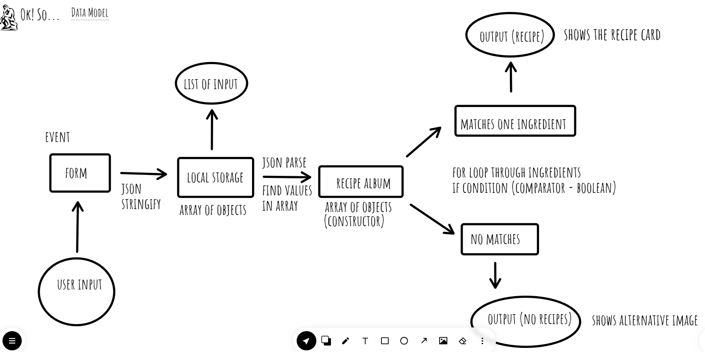

# pantry

## PantryPet

Git hub pages link: https://nellie-allsop.github.io/pantry/

## Team members:

- Manny
- Nellie
- Stephen

## Project description:

A site which both allows you to create a virtual pantry of all the food items in your house and see which recipes you might want to cook using those ingredients.

## Our domain model

## The overall problem domain and how the project solves those problems:

People can't always remember what food items they have in their houses, and coming up with recipe ideas isn't always easy.

Our project solves those problems by:

- Providing a virtual space where you can keep a record of all the food items in your house
- Offering inspiration for cooking by providing a recipe library that also shows you what recipe ingredients you do and don't have

## A list of any libraries, frameworks, or packages that your application requires in order to properly function:

- [placekitten] (https://placekitten.com/)

- [Google font] (https://fonts.googleapis.com/css2?family=Caveat:wght@500&family=Quicksand:wght@500&display=swap) - n.b. We did try to add these fonts to our project in a GDPR compliant way (see [this page] (https://www.cookieyes.com/documentation/features/google-fonts-and-gdpr/#:~:text=According%20to%20GDPR%2C%20an%20IP,party%20services%20without%20user%20consent), however we couldn't do this and so used another approach.)

## Instructions that the user may need to follow in order to get your application up and running on their own computer:

The user will need to follow our git hub pages link (see top of file) and then follow the instructions on our site

## References:

- [CSS Tools: Reset CSS] https://meyerweb.com/eric/tools/css/reset/

- [chatGPT] (https://chat.openai.com/auth/login) - we consulted this when debugging and also used this for our recipes.

- For our recipe images, we were not able to provide references but this is an area we could improve on in our next project.

- [Favicon] (https://www.flaticon.com/free-icon/cat-face_5702253)
